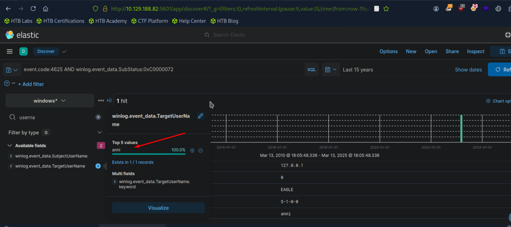
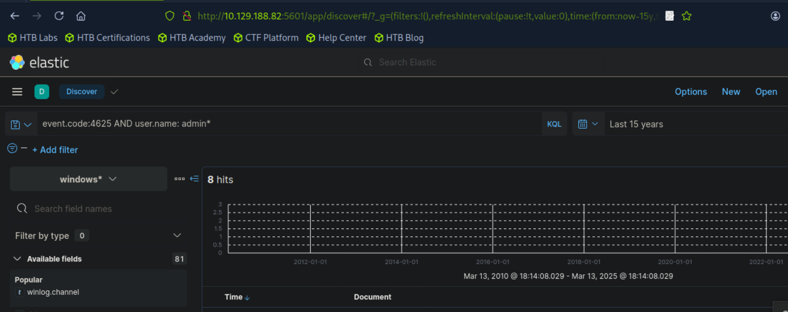

# Introduction To The Elastic Stack

Question:  Navigate to http://[Target IP]:5601, click on the side navigation toggle, and click on "Discover". Then, click on the calendar icon, specify "last 15 years", and click on "Apply". Finally, choose the "windows*" index pattern. Now, execute the KQL query that is mentioned in the "Comparison Operators" part of this section and enter the username of the disabled account as your answer. Just the username; no need to account for the domain.

Image:

Answer: anni

Question: Now, execute the KQL query that is mentioned in the "Wildcards and Regular Expressions" part of this section and enter the number of returned results (hits) as your answer.

Image:

Answer: 8

# SOC Definition & Fundamentals

Question: True or false? SOC 2.0 follows a proactive defense approach.

Answer: True

# MITRE ATT&CK & Security Operations

MITRE ATT&CK framework serves as an extensive, regularly, updated resource outlining the tctics, techniques, and procedures (TTPs) employed bycyber threat actors. 

MITRE ATT&CK framework not only serves as comprehensice resource for understanding adveresarial, techniques, andd  procedures (TTPs), but it also plays a crucial role in several aspects of Security Operations

Detection and Response

Security Evaluation and Gap Analysis

SOC Maturity Assessment

Threat Intelligence

Behavioral Analytics Development

Red Teaming and Penetration Testing

Training and Education

# SIEM Use Case Development

What Is A SIEM Use Case

Utilizing SIEM use cases is a fundamenetal aspect of crafting a robust cybersecurity strategy, as they enable the effective identification and detection of potential security incidents. 

